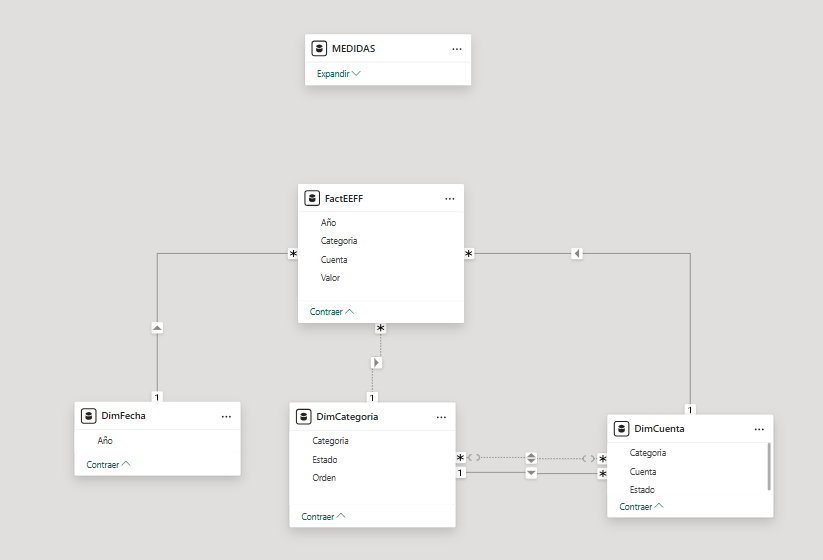
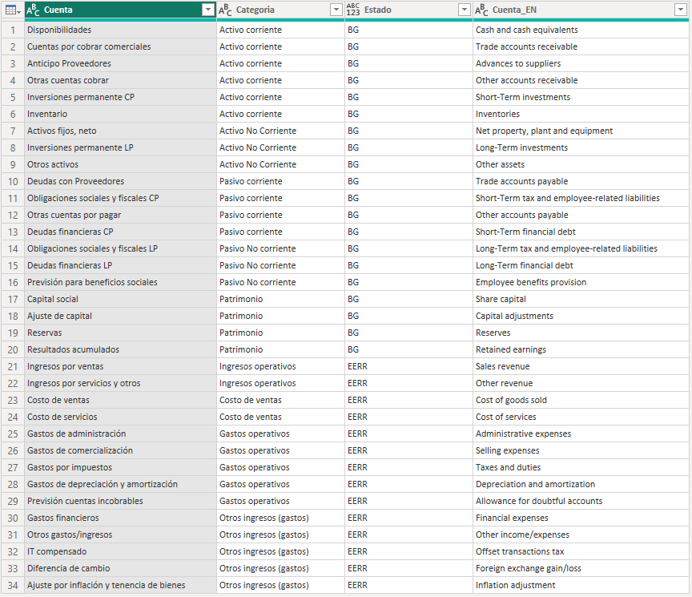
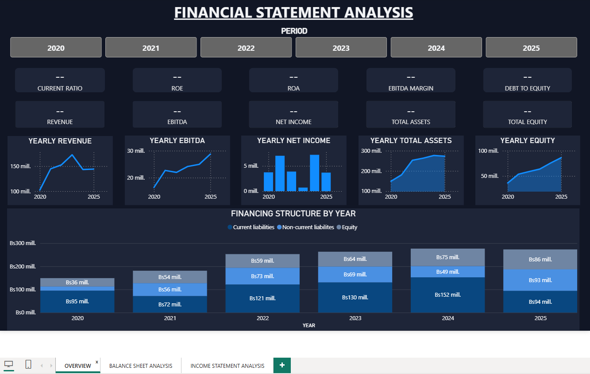
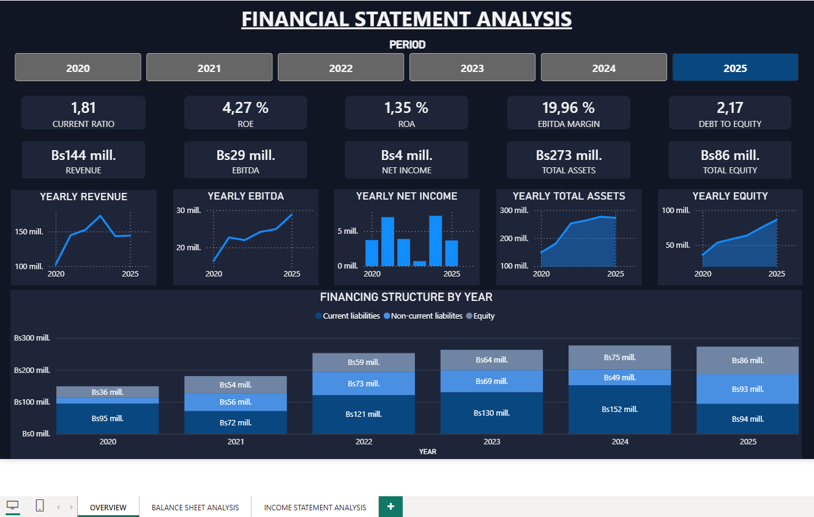
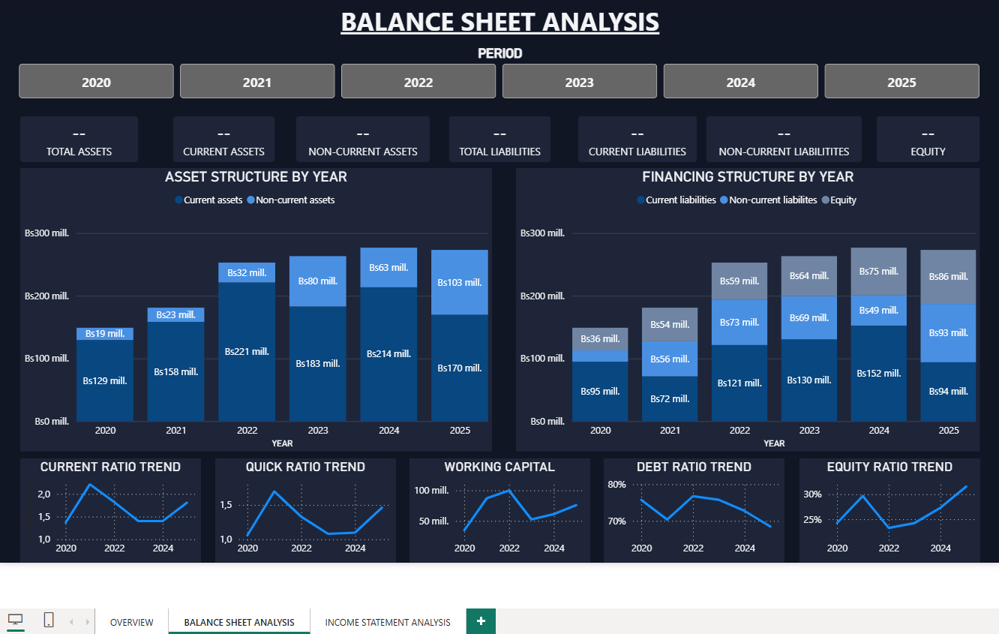
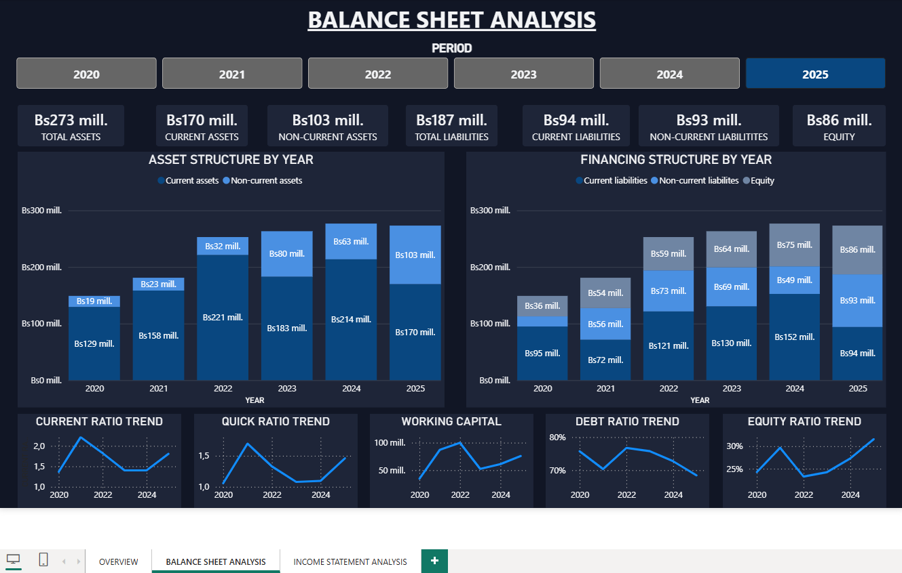

# Financial Statement Analysis (FSA)

Financial Statement Analysis dashboard developed in Power BI using audited financial statements as the only source of information.

## About the Project

This project started with a simple objective: transform audited financial statements into a structured analytical model capable of supporting financial analysis inside Power BI.

The financial data used in this project was obtained from publicly available audited financial statements published through the Bolivian Stock Exchange (Bolsa Boliviana de Valores - BBV). The original reports were published in PDF format and contain real financial information.

The name of the company has intentionally been omitted to keep the focus on the analytical methodology, data modeling process, and reporting architecture rather than on the financial performance of a specific organization.

The initial PDF-to-Excel transformation process was assisted by Microsoft Copilot to accelerate data extraction and structuring. All extracted information was subsequently validated manually through reconciliation procedures and accounting control checks, including verification of the fundamental accounting equation:

**Assets = Liabilities + Equity**

Once validated, the data was transformed in Power Query and modeled in Power BI.

The project focuses on building a complete end-to-end workflow covering financial statement extraction, validation, standardization, modeling, and analysis.

Beyond analyzing a single company, the model has been designed with scalability in mind. The objective is to establish a reusable framework that can later incorporate financial statements from additional companies while preserving the same analytical structure, measures, ratios, and reporting experience.

## Current Scope

Financial Statements currently included:

- Balance Sheet
- Income Statement

The model supports multi-year financial analysis, financial account hierarchies, and a standardized bilingual (Spanish/English) reporting structure.

## Data Model

Star schema model composed of:

- FactEEFF
- DimDate
- DimAccount

### Data Model Diagram

## Financial Account Standardization

To improve scalability and support future multi-company implementations, a bilingual account structure was implemented directly within the primary Balance Sheet and Income Statement Power Query tables.

A custom column named `Cuenta_EN` was created by referencing the original Spanish account names and applying standardized English financial terminology through Power Query transformation steps.

This approach allows all referenced queries, models, measures, and visualizations to inherit the translated account structure automatically, reducing maintenance efforts and improving consistency across the entire model.

This design also simplifies the future integration of additional companies into the model while maintaining a consistent analytical structure.

### Standardized Account Structure

## Workflow

1. Financial statement extraction from audited PDF reports
2. PDF-to-Excel structuring assisted by Microsoft Copilot
3. Manual validation and accounting reconciliation
4. Data transformation with Power Query
5. Financial account standardization
6. English financial terminology mapping
7. Dimensional modeling
8. DAX development
9. Financial analysis
10. Dashboard development

## Skills Demonstrated

- Financial Statement Analysis
- Power Query & Power BI
- DAX
- Data Modeling / Star Schema Design
- Financial Data & Terminology Standardization
- Financial Ratio Analysis
- Accounting Validation Procedures
- AI-Assisted Data Preparation
- Business Intelligence Reporting

## Current Progress

### Completed

- Balance Sheet and Income Statement data modeling
- Financial account categorization and statement hierarchy implementation
- Star schema design and Power Query transformation framework
- Core Balance Sheet and Income Statement measures
- EBITDA calculation methodology
- Financial ratio framework implementation
- Measure folder architecture following Power BI modeling best practices
- Financial reporting matrix development
- Balance Sheet and Income Statement account translation framework (Spanish → English)
- Reusable account translation layer implemented in Power Query
- Overview dashboard development
- Balance Sheet Analysis dashboard development
- Asset Structure by Year visualization
- Financing Structure by Year visualization
- Liquidity and solvency trend framework
- Capital structure visualization
- Executive-level financial KPI framework

## Dashboard Development

### Overview

The first dashboard page was designed to provide a high-level overview of the company's financial position, profitability, solvency, and capital structure.

Current features include:

- Revenue
- EBITDA
- Net Income
- Total Assets
- Total Equity
- Current Ratio
- ROA
- ROE
- EBITDA Margin
- Debt to Equity

Additional visualizations include:

- Historical KPI trends
- Revenue trend analysis
- EBITDA trend analysis
- Net Income trend analysis
- Asset growth analysis
- Equity growth analysis
- Financing Structure by Year
- Interactive period selection

The objective of this page is to summarize the company's financial performance and financial condition in a single executive-level dashboard.

### Overview Page Preview

#### No Period Selected

#### Period Selected

### Balance Sheet Analysis

The second dashboard page focuses on analyzing the company's financial position through asset composition, financing structure, liquidity, and solvency indicators.

Current features include:

- Total Assets
- Current Assets
- Non-Current Assets
- Total Liabilities
- Current Liabilities
- Non-Current Liabilities
- Equity

Additional visualizations include:

- Asset Structure by Year
- Financing Structure by Year
- Current Ratio Trend
- Quick Ratio Trend
- Working Capital
- Debt Ratio Trend
- Equity Ratio Trend

The objective of this page is to provide a detailed view of the company's financial position, asset composition, sources of financing, liquidity profile, and solvency evolution over time.

### Balance Sheet Analysis Preview

#### No Period Selected

#### Period Selected

## Currently Working On

### Analytical Pages

- Income Statement Analysis page
- Financial Ratios dashboard page
- Additional analytical measures

### Design & User Experience

- Dashboard navigation experience
- Visual design refinement
- Report styling and visual consistency
- Visual formatting optimization

## Project Status

**Active Development**

The current version includes a fully functional Overview page and a dedicated Balance Sheet Analysis page supported by a dimensional financial model, translated account structure, financial ratio framework, and historical trend analysis.

Current development efforts are focused on expanding the analytical capabilities of the report, beginning with the Income Statement Analysis page and additional financial risk and performance metrics.

**Work in Progress**
